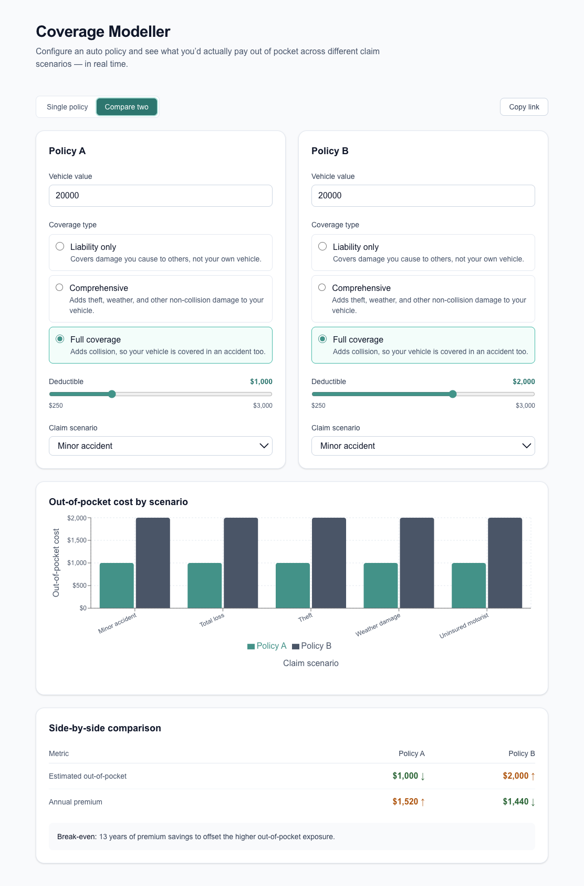
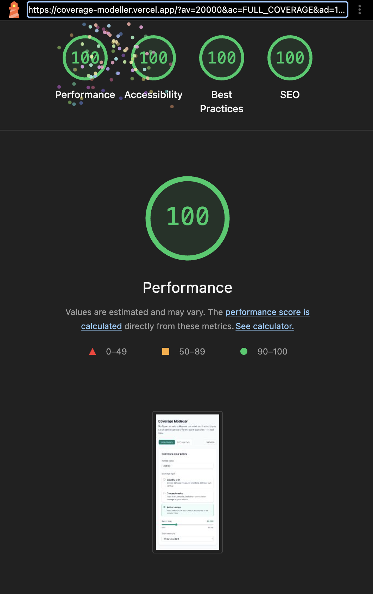

[](https://github.com/markwaldron7string/coverage-modeller/actions/workflows/test.yml)
[](https://coverage-modeller.vercel.app/)

# Coverage Modeller

After seven years in insurance underwriting, the hardest conversation to have
with a customer was always the trade-off conversation: is the lower-deductible
policy actually worth it for *your* situation? The honest answer depends on
deductibles, coverage limits, exclusions, and which claim you're imagining — and
no agent can hold all of that in their head on a live call. Coverage Modeller
makes that question answerable in real time.

It's an interactive tool for modelling auto-insurance coverage scenarios and
comparing out-of-pocket costs across different deductible and coverage
combinations — built around a problem I lived from the inside.

**Live demo:** https://coverage-modeller.vercel.app/



## What it does

- **Single-policy modeller** — set vehicle value, coverage selections,
  deductible, and a claim scenario, and watch the estimated out-of-pocket cost,
  coverage payout, and annual premium update in real time.
- **Side-by-side comparison** — configure two policies and compare their
  out-of-pocket cost across all five claim scenarios, visualised as a grouped bar
  chart.
- **Shareable links** — the full configuration is encoded in the URL, so any
  scenario can be bookmarked or shared and reopens exactly as it was left.
- **Plain-language explanations** — a generated paragraph explains, in plain
  English, what the selected coverage means for the chosen deductible and vehicle
  value.

## Tech stack

- **Next.js (App Router)** — a server-rendered shell with client components for
  the interactive modeller; deploys to Vercel with zero configuration.
- **TypeScript (strict)** — coverage-to-claim eligibility is modelled with an
  exhaustive `Record<ScenarioType, …>` map tying each claim scenario to the
  coverage(s) that satisfy it, so adding a new scenario won't compile until it's
  been handled everywhere that matters.
- **Zustand** — shares the two independent policy configurations across the
  modeller and comparison views as reference-stable slices, avoiding React
  Context re-render churn and prop-drilling.
- **Recharts** — renders the grouped comparison bar chart, paired with a
  visually-hidden data table so the chart is fully available to screen readers.
- **Tailwind CSS** — utility styling layered over semantic HTML (the
  accessibility work depends on correct elements, not just correct classes).
- **Jest + React Testing Library** — the calculation layer is pure functions,
  making the business logic exhaustively unit-testable; components are tested for
  behaviour and accessibility.
- **GitHub Actions** — type-checks and runs the full test suite on every push and
  pull request to `main`; the badge above tracks it.

## A few decisions worth calling out

- **Coverage modelled as it actually composes, not as exclusive tiers.** No U.S.
  state requires comprehensive or collision coverage — they're always
  independent, optional add-ons on top of a liability baseline, and "Full
  Coverage" isn't real policy terminology. The coverage model, calculations, and
  UI were rebuilt around that: liability is implicit, and comprehensive,
  collision, and uninsured/underinsured motorist are each independently
  selectable. The tool is explicit about its own scope, too — a footer note
  makes clear it illustrates coverage trade-offs rather than representing any
  specific state's requirements or a real carrier's product.
- **A pure calculation core.** Out-of-pocket cost, premium, payout, and
  break-even are pure functions with no UI dependencies, which made the business
  logic exhaustively testable and kept the components thin.
- **SSR-safe URL state.** The shared-link feature hydrates state from the URL
  inside a client effect, so the server and the first client render match (no
  hydration mismatch) before the URL takes over.
- **Accessibility built in, not bolted on.** Native form controls, ARIA live
  regions for derived results, a visually-hidden table mirroring the chart, and
  status conveyed by icon and text rather than colour alone.

## Performance & accessibility

Lighthouse audit — incognito Chrome on the deployed production build:

| Category       | Score |
| -------------- | ----- |
| Performance    | 100   |
| Accessibility  | 100   |
| Best Practices | 100   |
| SEO            | 100   |



Accessibility was built to WCAG 2.1 AA from the start. Full audit notes,
including the axe DevTools results and the manual keyboard pass, are in
[docs/accessibility.md](docs/accessibility.md).

## Running locally

```bash
git clone https://github.com/markwaldron7string/coverage-modeller.git
cd coverage-modeller
npm install
npm run dev
```

Open http://localhost:3000. Requires Node.js 20.9 or newer.

## Scripts

- `npm run dev` – start the dev server
- `npm run build` – production build
- `npm test` – run the test suite
- `npm run lint` – lint
- `npm run format` – format with Prettier